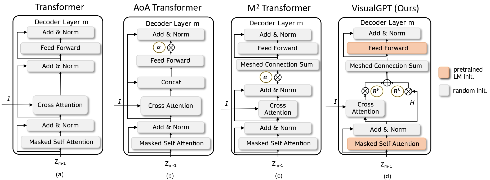

# 뇌경색 판독문 자동 생성 - img2txt

## Data
### DWI 뇌경색 데이터
1. hallym data
  * disease (1,200개) : 뇌경색 dwi data, Dicom파일
  * normal (100개) : dwi data, Dicom파일
  * mr_txt.xlsx : disease/normal 판독문 및 환자 정보
  * Brain MRI report.xls : embedding용 mri 판독문 모음
  * 데이터중심병원 : 3520개 => 판독문 및 anotation 파일 없음(23.01.31 기준)
2. knu data
  * disease (1,182개) : Dicom파일
  * normal (22개) : Dicom파일
  * 강원대학교 병원.xlsx : Tabular data
  * 영상 판독지 요청 자료.xls : disease/normal 판독문 및 환자 정보 => 정제되지 않음, 검토 필요한 데이터
### CT 뇌출혈 데이터
1. CT data
  * CC_case (3,222개) : 춘천성심병원 CT 데이터, Dicom파일
  * HL_case (7,307개) : 평촌성심병원 CT 데이터, Dicom파일
  * HL_normal (30,576개) : 평촌성심병원 CT normal 데이터, Dicom파일
    - CC_case, HL_case, HL_normal 모두 Annotation 파일 없음(23.01.31 기준)
  * hallym_CT (ver 1.0 2022.3.27).xlsx : 평촌성심병원 CT 판독문
  * ich_chuncheon.xlsx : 춘천성심병원 CT 판독문
  * normal_chuncheon.xlsx :  평촌성심병원 CT normal 판독문
    - 판독문 3개 모두 CT데이터와 id가 일부 match되지 않음 (23.01.31 기준) => 김철호 교수님께 문의
    - case 판독문의 경우 ich(뇌출혈)=1인 데이터 사용
    - nomral 판독문의 경우 ich(뇌출혈)=0인 데이터 사용
    - series=1, new_series=1인 데이터 사용 => series=ct찍은 순서(여러 번 찍은 환자도 있기 때문)
    - id = ct data 폴더명과 일치, 환자 번호

## Train the model
data_type = ct / mri 두가지 중 하나로 설정
data_channel = mri일 경우 3으로 설정, ct일 경우 원하는 채널 수 만큼 설정

**visualgpt gitlab 코드를 참고하여 데이터 부분만 변경하여 사용, 아래 gitlab주소 활용할 것**

**[주요 추가,변경 부분]**
- CustomDataModule.py
- CustomDataset.py
  - mri 데이터의 경우 mask 기준 가장 병변이 많은 slice 3개를 dicom 파일에서 뽑아 사용, dicom을 hdf5로 변환하여 사용
  - CT데이터의 경우 dicom 파일을 nifti파일로 변환하여 사용

**[train data 활용 예시 - mri]**
|caption|image|input_img1|input_img2|input_img3|
|------|---|---|---|---|
|focal small diffusion restriction|/data/hdf5_hallym/train/HALLYM_CC_0391.hdf5|input_00000010|input_00000029|input_00000016|
|multiple diffusion restriction|/data/hdf5_hallym/train/HALLYM_CC_0214.hdf5|input_00000010|input_00000011|input_00000014|

**[train data 활용 예시 - ct]**
|caption|image|
|------|---|
|No demonstrable abnormal finding.|/data/nifti/HL_case/104634/104634.nii.gz|
|Left basal ganglia intracerebral hemorrhage|/data/nifti/CC_case/2085/2085.nii.gz|

**[train]**
```
python train_visualGPT.py  --exp_name visualGPT
  --train_data_path /home/lab/sangjee/strok/data/ctdata_train.csv
  --test_data_path /home/lab/sangjee/strok/data/ctdata_test.csv
  --val_data_path /home/lab/sangjee/strok/data/ctdata_val.csv
  --epoch 100
  --patience 5
  --batch_size 16
  --eval_batch_size 16
  --num_workers 4
  --head 12
  --logs_folder /home/lab/sangjee/strok/tensorlog
  --random_seed 42
  --gpt_model_type gpt
  --lr 1e-4
  --log_file /home/lab/sangjee/strok/log/visualGPT.txt
  --gradient_accumulation_steps 1
  --num_train_epochs 3.0
  --optimizer_type adamw
  --max_grad_norm 1.0
  --train_percentage 1.0
  --reinforcement_lr 1e-5
  --decoder_layer 12
  --encoder_layer 3
  --tau 0.0
  --data_type ct
  --data_channel 20
```


## VisualGPT
[gitlab](https://github.com/Vision-CAIR/VisualGPT)

Our Paper [VisualGPT: Data-efficient Adaptation of Pretrained Language Models for Image Captioning](https://arxiv.org/abs/2102.10407)

### Main Architecture of Our VisualGPT



### Download the GPT-2 pretrained weights
```
curl --output gpt2-pytorch_model.bin https://s3.amazonaws.com/models.huggingface.co/bert/gpt2-pytorch_model.bin
```

### Data preparation
We provide the COCO dataset for downloading. Please download the annotations file [annotations.zip](https://drive.google.com/file/d/1i8mqKFKhqvBr8kEp3DbIh9-9UNAfKGmE/view?usp=sharing) and extract it.
and [coco_detections.hdf5](https://drive.google.com/open?id=1MV6dSnqViQfyvgyHrmAT_lLpFbkzp3mx), in which the data is stored in a `<key, value>` where key is the image id and value is a tensor (N, 2048). N it the number of detections


## Acknowledgement
This code used resources from [Meshed Memory Transformer](https://github.com/aimagelab/meshed-memory-transformer) and [Transformers](https://github.com/huggingface/transformers)